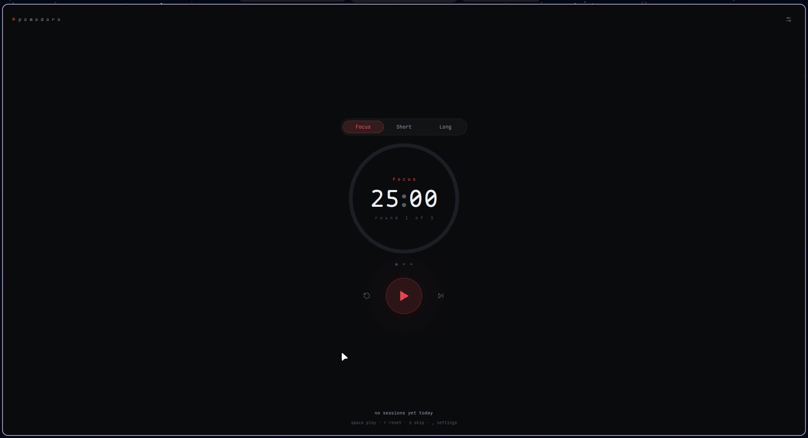

# Pomo
<p align="center">
  
</p>
<p align="center">
  <strong>A minimal, beautiful Pomodoro timer for your desktop</strong>
</p>

<p align="center">
  Built with <a href="https://github.com/zed-industries/zed/tree/main/crates/gpui">GPUI</a> and Rust.
</p>

<p align="center">
  <a href="https://github.com/WynnCr/Pomo/releases">Releases</a>
  ·
  <a href="https://github.com/WynnCr/Pomo/issues">Issues</a>
  ·
  <a href="https://github.com/WynnCr/Pomo/blob/main/LICENSE">License</a>
</p>

---

## Overview

**Pomo** is a pomodoro timer with a minimal design.

With no extra fluff.

## Features

* **25-minute focus sessions**
* **5-minute short breaks**
* **15-minute long breaks**
* Automatic long break after every 4 completed focus sessions
* Smooth animated progress bar
* Session progress indicator
* Start, pause, resume, reset and skip controls
* Desktop notifications when a session ends
* Different visual accents for focus and break sessions
* Bundled **Maple Mono NF** typography
* Native desktop application
* Lightweight and fast

## Installation

### Linux

Pre-built Linux packages are available from the [Releases](https://github.com/WynnCr/Pomo/releases) page.

Pomo currently provides:

* **AppImage** — universal, portable, no installation required
* **RPM** — for RPM-based distributions such as fedora, etc.

#### AppImage

Download the latest `.AppImage` from Releases:

```bash
chmod +x pomo-*.AppImage
./pomo-*.AppImage
```
or just use an appimage manager like gearlever.

#### RPM

On RPM-based distributions:

```bash
sudo rpm -i pomo-*.rpm
```

## Build from Source

### Requirements

* Rust
* A working desktop environment
* System libraries required by GPUI

Clone the repository:

```bash
git clone https://github.com/WynnCr/Pomo.git
cd Pomo
```

Build:

```bash
cargo build --release
```

Run:

```bash
cargo run --release
```

## Development

Pomo is intentionally kept small and straightforward.

The application is written in **Rust** and uses **GPUI** for its UI, with **GPUI-Kit** providing reusable UI components.

## Roadmap

Pomo is still evolving. Some ideas for future releases include:

* [ ] Custom focus / break durations
* [ ] Configurable Pomodoro cycles
* [ ] Persistent settings
* [ ] Session history
* [ ] Daily statistics
* [ ] Keyboard shortcuts
* [ ] System tray integration
* [ ] More notification options
* [ ] Improved accessibility

Windows and macOS builds are not available because I haven't been able to test them since I use only linux.

Have an idea? Open an [issue](https://github.com/WynnCr/Pomo/issues).

## Contributing

Contributions are welcome.

If you find a bug, have an idea, or want to improve something:

1. Open an [issue](https://github.com/WynnCr/Pomo/issues) or discussion.
2. Fork the repository.
3. Create a branch for your changes.
4. Make your changes.
5. Open a pull request.

For larger changes, opening an issue first is recommended so the direction can be discussed.

## Why Pomo?

Tbh, idk.
I was just building this while learning...

## Technology

| Technology                                                          | Purpose                |
| ------------------------------------------------------------------- | ---------------------- |
| [Rust](https://www.rust-lang.org/)                                  | Application logic      |
| [GPUI](https://github.com/zed-industries/zed/tree/main/crates/gpui) | Native UI              |
| [GPUI-Kit](https://github.com/longbridge/gpui-component)            | UI components          |
| [Maple Mono](https://github.com/subframe7536/maple-font)            | Application typography |

## License

Pomo is free and open-source software licensed under the **GNU General Public License**
